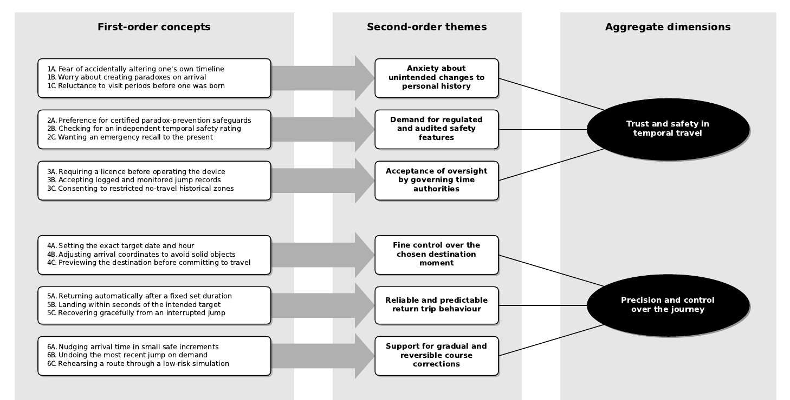

# qdvc-gioia-diagram

Generate a **Gioia-style data structure diagram** (Gioia, Corley & Hamilton, 2013) from a simple three-column CSV.

Here's what `python3 gioia.py -m -v example/example.csv example/example.pdf` turns our [example.csv](example/example.csv) into:



(Full PDF version [here](example/example.pdf).)

**QDVC = Quick and Dirty, Vibe-Coded:** it was built rapidly and conversationally with an AI assistant rather than through a formal engineering process, so treat it as a handy, deliberately small utility rather than production-grade software (the documentation was vibe-coded too). That said, "vibe-coded" is not an excuse for an undocumented black box: the whole conversational build is recorded in the [`vibe-coding/`](vibe-coding/) folder, where each round preserves the user request, the assistant's response, and the resulting Git commit hash, so the origin stays fully auditable rather than opaque.

## Installation and usage

Requires Python 3 and matplotlib:

```bash
pip install -r requirements.txt
```

Run it with an input CSV and an output filename (the format is inferred from the extension):

```bash
python gioia.py INPUT.csv OUTPUT.pdf [options]
```

The input CSV must have exactly these three columns:

```csv
first_order_concept,second_order_theme,aggregate_dimension
```

The hierarchy is many-to-one at each level: many first-order concepts belong to one second-order theme, and many themes belong to one aggregate dimension. Row order is preserved top-to-bottom.

| Option | Description |
| --- | --- |
| `-m`, `--mono-enum` | Render the enumeration labels (`1A`, `1B`, ...) in a monospace font; concept text stays in the normal font. Off by default. |
| `-v`, `--verbose` | Print timed progress messages while the diagram is built. |
| `-h`, `--help` | Show usage help. |

A sample dataset, [`example.csv`](example/example.csv), is included. Try it with:

```bash
python gioia.py example/example.csv example/example.pdf
```

or, for the monospace-enumeration variant with progress output:

```bash
python gioia.py example/example.csv example/example.png --mono-enum --verbose
```

## Background and a caveat

The diagram is the "data structure" from the Gioia methodology:

> Gioia, D. A., Corley, K. G., & Hamilton, A. L. (2013). Seeking Qualitative Rigor in
> Inductive Research. *Organizational Research Methods, 16*(1), 15–31.
> https://doi.org/10.1177/1094428112452151

It shows the progression from informant-centric first-order codes, to researcher-centric
second-order themes, to aggregate theoretical dimensions — making the journey from data
to theory visible.

A tidy diagram is easy to mistake for rigorous analysis. Even Gioia and colleagues
cautioned against treating the approach as a rigid template or formula, a concern
developed further by:

> Mees-Buss, J., Welch, C., & Piekkari, R. (2022). From Templates to Heuristics: How and
> Why to Move Beyond the Gioia Methodology. *Organizational Research Methods, 25*(2),
> 405–429. https://doi.org/10.1177/1094428120967716

They argue that using the methodology as a *template* does not by itself address the
interpretive challenges of moving from field data to theory, and call for interpretive
rather than merely procedural rigor. In short: **this tool draws the picture; it does not
do the thinking.** Use it to communicate analysis you have actually done.

This utility is not affiliated with or endorsed by any of the authors cited above; the
references are provided for context and acknowledgement.
